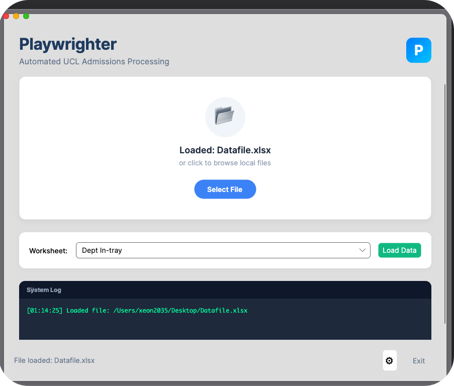
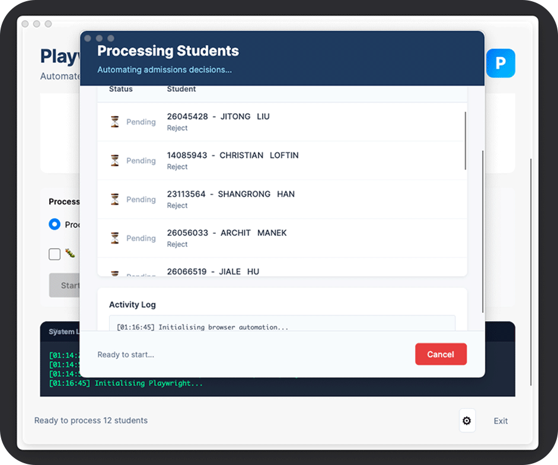
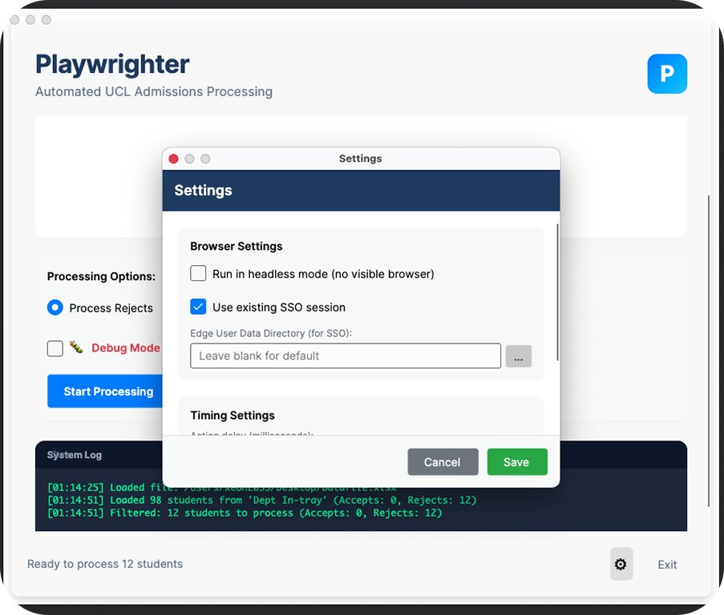
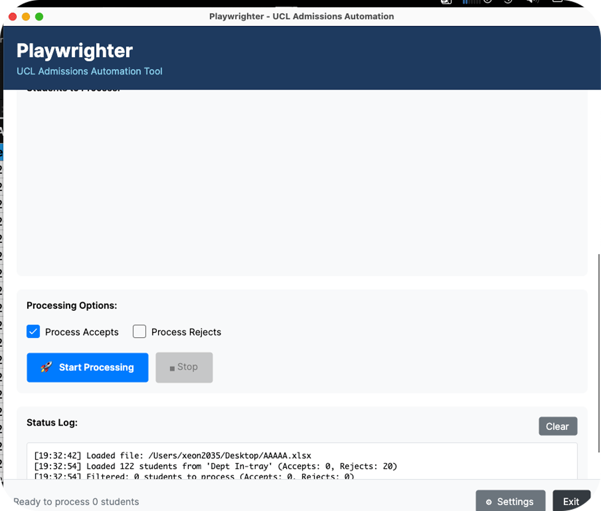

<div align="center">
  <h1>Playwrighter</h1>
  <p><strong>Automate UCL Portico admissions processing with Playwright browser automation</strong></p>

<table>
  <tr>
    <td></td>
    <td></td>
  </tr>
  <tr>
    <td></td>
    <td></td>
  </tr>
</table>

[](https://dotnet.microsoft.com/)
[](https://avaloniaui.net/)
[](https://playwright.dev/)
[]()

</div>

---

## About the Project

**Playwrighter** is a cross-platform desktop application that automates the repetitive task of processing student admissions decisions in UCL's Portico system. Instead of manually clicking through dozens of student records, simply load your Excel spreadsheet and let the automation handle the rest.


The app utilises <a href="https://playwright.dev/">Playwright</a>, an open-source browser automation tool developed by Microsoft, to automate web browsers for testing, automation, and interaction with web applications—such as clicking buttons, filling forms, capturing screenshots, and navigating pages.
### The Problem

During admissions season, staff must process hundreds of student applications by:
1. Searching for each student by number
2. Clicking into their application (selecting the correct programme if multiple exist)
3. Navigating to the Actions tab
4. Clicking "Recommend Offer or Reject"
5. Selecting the appropriate decision
6. Clicking Process
7. Repeating for every student...

This manual process is tedious, error-prone, and time-consuming.

### The Solution

Playwrighter reads your decisions from an Excel spreadsheet and automates the entire workflow using Microsoft Edge browser automation. It intelligently matches students to their correct programme applications and processes offers or rejections in seconds.

---

## Features

| Feature | Description |
|---------|-------------|
| **Drag and Drop Excel** | Simply drag your spreadsheet onto the app |
| **Smart Programme Matching** | Automatically maps short codes (ML, CS, FT) to Portico codes (TMSCOMSMCL01, etc.) |
| **Batch Processing** | Process multiple Accept/Reject decisions in one run |
| **Persistent Login** | SSO session saved between runs — no repeated MFA |
| **Real-time Status** | Live progress log shows each step |
| **Cross-Platform** | Works on Windows, macOS, and Linux |
| **Configurable** | Adjust delays, headless mode, and more |

---
Architecture
Playwrighter follows the MVVM (Model-View-ViewModel) architectural pattern, providing clear separation of concerns for maintainability and testability.
┌─────────────────────────────────────────────────────────────┐


Key Components:

Views — Avalonia XAML windows and controls (MainWindow, ProcessingWindow, SettingsWindow)
ViewModels — Handle UI state and expose observable properties for data binding
Models — Data structures for students, decisions, and programme mappings
Services — Business logic for Excel parsing, programme matching, and Playwright automation

## Programme Code Mapping

The app automatically converts spreadsheet short codes to Portico programme codes:

| Excel Code | Portico Code | Programme |
|------------|--------------|-----------|
| ML | TMSCOMSMCL01 | MSc Machine Learning |
| CS | TMSCOMSING01 | MSc Computer Science |
| DSML | TMSDATSMLE01 | MSc Data Science and Machine Learning |
| FT | TMSFINSTEC01 | MSc Financial Technology |
| CGVI | TMSCOMSCGV01 | MSc Computer Graphics and Vision |
| RAI | TMSROBAARI01 | MSc Robotics and AI |
| AISD | TMSARTSINT02 | MSc AI for Sustainable Development |
| ... | ... | *and more* |

---

## Tech Stack

| Technology         | Purpose                              |
|--------------------|--------------------------------------|
| **C#**             | Code Language                        |
| **.NET 10**        | Runtime framework                    |
| **Avalonia UI 11** | Cross-platform UI framework          |
| **Playwright**     | Browser automation engine            |
| **EPPlus**         | Excel file parsing                   |
| **Microsoft Edge** | Automated browser (with SSO support) |

---

## Project Structure

```text
playwrighter/
├── App.axaml                 # Application XAML
├── App.axaml.cs
├── MainWindow.axaml          # Main UI layout
├── MainWindow.axaml.cs       # UI logic and event handlers
├── SettingsWindow.axaml      # Settings dialog
├── SettingsWindow.axaml.cs
├── Program.cs                # Entry point
├── Models/
│   ├── StudentRecord.cs      # Student data model
│   └── AppConfig.cs          # Configuration model
├── Services/
│   ├── ExcelService.cs       # Excel parsing logic
│   ├── PorticoAutomationService.cs  # Playwright automation
│   └── Interfaces/
├── public/
│   └── images/               # Screenshots and logo
├── Playwrighter.csproj
└── Playwrighter.sln
```

---

## Getting Started

### Prerequisites

- [.NET 10 SDK](https://dotnet.microsoft.com/download)
- Microsoft Edge browser installed
- Playwright browsers installed

### Installation

```bash
# Clone the repository
git clone https://github.com/YOUR_USERNAME/playwrighter.git
cd playwrighter

# Restore dependencies
dotnet restore

# Install Playwright browsers (first time only)
dotnet tool install -g Microsoft.Playwright.CLI
playwright install msedge

# Build and run
dotnet build
dotnet run
```

---

## Usage

1. **Load Excel file** — Drag and drop or browse to select your admissions spreadsheet
2. **Select worksheet** — Choose the sheet containing student decisions (auto-selects "Dept In-tray")
3. **Filter decisions** — Check "Process Accepts" and/or "Process Rejects"
4. **Click Start** — The browser will launch and begin automation
5. **Complete MFA** — On first run, complete SSO/MFA login (session saves for 60 days)
6. **Monitor progress** — Watch the status log for real-time updates

### Expected Excel Format

Your spreadsheet should have columns including:

| StudentNo | Programme | Decision | *(other columns)* |
|-----------|-----------|----------|-------------------|
| 26034803 | ML | Accept | ... |
| 26045424 | CS | Reject | ... |
| 23014690 | ML | Accept | ... |

---

## Configuration

Click the ⚙️ Settings button to configure:


| Setting | Description | Default |
|---------|-------------|---------|
| **Headless Mode** | Run browser invisibly | Off |
| **Action Delay** | Milliseconds between actions | 100ms |
| **Portico URL** | Login page URL | evision.ucl.ac.uk |

---

## How It Works

```
┌─────────────────┐     ┌─────────────────┐     ┌─────────────────┐
│  Excel File     │────▶│  Playwrighter   │────▶│  Portico        │
│  (Decisions)    │     │  (Automation)   │     │  (Browser)      │
└─────────────────┘     └─────────────────┘     └─────────────────┘
                              │
                              ▼
                    ┌─────────────────────┐
                    │  For each student:  │
                    │  1. Search by ID    │
                    │  2. Match programme │ 
                    │  3. Click Actions   │
                    │  4. Process decision│
                    └─────────────────────┘
```

---

## Troubleshooting

| Issue | Solution |
|-------|----------|
| **Playwright not found** | Run `playwright install msedge` |
| **Wrong row clicked** | Ensure Programme column matches short codes (ML, CS, etc.) |
| **Login timeout** | Complete MFA within 4 minutes |
| **Browser closes unexpectedly** | Check Status Log for error details |

---

## Contributing

Contributions are welcome. Feel free to open an issue or submit a pull request.

---

## Licence

Distributed under the MIT Licence. See `LICENCE` for more information.

---

## Disclaimer

This tool is for authorised UCL staff use only. Ensure you have appropriate permissions before automating Portico interactions. The authors are not responsible for any misuse or unintended consequences.

<br />
<br />

<div align="center">
  <a href="https://techangelx.com" target="_blank">
    
  </a>
  <br /><br />
  <span style="font-size: 1.4em; font-weight: 300;">
    Built by Ricki Angel • <a href="https://techangelx.com" target="_blank" style="text-decoration: none;">Tech Angel X</a>
  </span>
</div>
